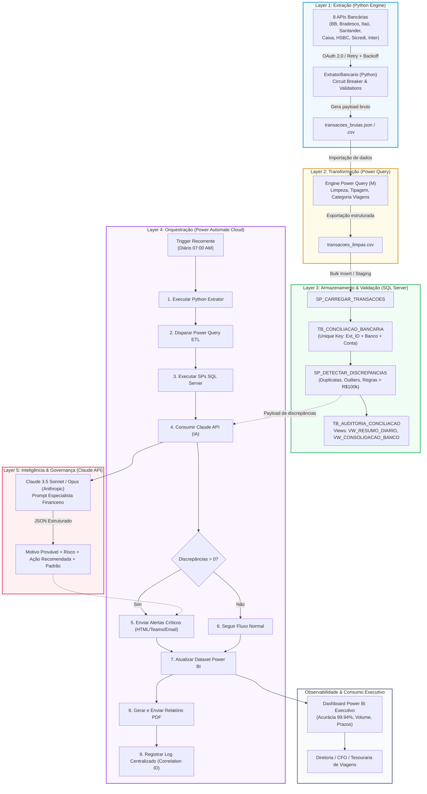

# ARQUITETURA DA SOLUÇÃO
## Sistema Integrado de Conciliação Bancária & Análise Inteligente
**Candidato:** Diego Luiz Lino de Aquino  
**Agente Responsável:** Agent 2 - Arquiteto de Sistemas (Especialista em Engenharia de Software e RPA)  
**Data da Decisão:** 2026-09-21  

---

### 1. Diagrama Geral de Fluxo da Solução

---

### 2. Detalhamento das 5 Layers Principais

#### Layer 1: Extração (Python Engine)
- **Componentes:**
  - `ExtratorBancario`: Classe central de extração com suporte simultâneo a 8 bancos.
  - `OAuth2TokenManager`: Gerenciamento, renovação e cache seguro de tokens Bearer.
  - `CircuitBreaker`: Interrupção temporária de requisições a bancos que atinjam limiar de indisponibilidade (evitando exaustão de conexões).
  - `RetryWithBackoff`: Retentativas com decaimento exponencial e jitter aleatório.
  - `StructuredJsonLogger`: Geração de logs estruturados em formato JSON com correlation ID.
- **Tecnologias:** Python 3.10+, `requests`, `pandas`, `pydantic`, `python-dotenv`.
- **Padrões de Design:** Factory Method (criação de conectores bancários), Singleton (Token Manager), Circuit Breaker, Strategy (estratégias de autenticação por banco).

#### Layer 2: Transformação (Power Query / M Engine)
- **Componentes:**
  - Script M de ingestão do arquivo unificado gerado pela extração.
  - Pipeline de tipagem rígida, substituição de valores nulos e trim de caracteres espúrios.
  - Regra de categorização específica para o segmento de viagens corporativas (Passagens, Hospedagens, Transfers, Seguros, Taxas).
  - Deduplicação primária baseada na tupla composta `[ID_Transacao, Banco, Conta, Valor]`.
- **Tecnologias:** Power Query Engine (Linguagem M), Power BI Desktop / Dataflows.
- **Padrões de Design:** Pipeline / Filters (cadeia de transformações determinísticas e sequenciais).

#### Layer 3: Armazenamento & Validação (SQL Server)
- **Componentes:**
  - Tabela Central: `TB_CONCILIACAO_BANCARIA` com chave primária e restrição de unicidade composta (`UK_EXTERNO`).
  - Tabela de Governança: `TB_AUDITORIA_CONCILIACAO` rastreando operações, valores pré/pós alteração e usuários.
  - Stored Procedures: `SP_CARREGAR_TRANSACOES` (ingestão atômica) e `SP_DETECTAR_DISCREPANCIAS` (regras contábeis de duplicidade, outliers estatísticos a 2 desvios-padrão e transações críticas > R$ 100k).
  - Views Analíticas: `VW_RESUMO_DIARIO` e `VW_CONSOLIDACAO_BANCO` pré-calculando agregados para a camada de BI.
- **Tecnologias:** Microsoft SQL Server / Azure SQL, T-SQL, Índices B-Tree.
- **Padrões de Design:** Staging Table Pattern, Write-Ahead Audit Trail, View Materialization Pattern.

#### Layer 4: Orquestração (Power Automate Cloud)
- **Componentes:**
  - Gatilho Recorrente (`Recurrence Trigger` diário às 07:00 AM Brasil/SP).
  - Ações encadeadas com tratamento de contingência (`RunAfter: HasFailed, HasTimedOut`).
  - Chamadas de scripts em Gateway On-Premises ou Cloud Runners.
  - Conexão HTTP nativa para acionamento da API de Inteligência Artificial.
  - Conectores nativos do Office 365 Outlook e Power BI Service.
- **Tecnologias:** Microsoft Power Automate Cloud, Logic Apps Runtime.
- **Padrões de Design:** Saga Orchestrator, Compensating Actions, Circuit Interrupter.

#### Layer 5: Inteligência & Decisão (Claude API)
- **Componentes:**
  - Módulo `AnalisadorIADiscrepancias`: Cliente em Python / Chamada HTTP com prompt contextualizado no negócio de viagens corporativas.
  - Validador de Schema JSON: Garantia estrita de que a resposta da LLM respeite o formato esperado pelo Power Automate.
  - Sistema de Classificação de Risco (Baixo, Médio, Alto) com estimativa quantitativa de confiança (0.0 a 1.0).
  - Repositório de Feedback Loop para persistência e aprendizado de falsos-positivos.
- **Tecnologias:** Claude 3.5 Sonnet / Opus (Anthropic API), Pydantic.
- **Padrões de Design:** Chain of Thought Prompting, Guardrails / Structured Output Enforcer.

---

### 3. Decisões Arquiteturais Críticas

#### Decisão 1: Por que Python para Extração Bancária em vez de Conectores Power Automate HTTP?
- **Contexto:** Necessidade de consumir 8 bancos comerciais com fluxos de autenticação OAuth 2.0 heterogêneos, assinaturas mTLS e endpoints com particularidades de paginação e cabeçalhos.
- **Prós do Python:** Total flexibilidade para lidar com headers proprietários de bancos, controle de certificados digitais (mTLS), implementação nativa de Circuit Breaker e testes automatizados com mocks locais.
- **Contras do Python:** Demanda um ambiente de execução (Cloud VM, Container ou Gateway On-Premises).
- **Alternativa Considerada:** Conectores HTTP nativos do Power Automate Cloud.
- **Por que a alternativa foi descartada:** Limitações de timeout rígido (120s), dificuldade para manipulação de mTLS e alto custo de connectors premium para chamadas massivas repetidas.
- **Escolha:** Python Engine modular.
- **Confiança:** 98%
- **Data da Decisão:** 2026-09-21

#### Decisão 2: Por que SQL Server Relacional em vez de CosmosDB / NoSQL?
- **Contexto:** Armazenamento de conciliação bancária que exige integridade contábil e auditoria estrita.
- **Prós do SQL Server:** Garantia ACID completa, integridade referencial nativa, suporte a Stored Procedures com cálculos estatísticos (STDEV, AVG) e integração perfeita com Power BI via DirectQuery ou Importação.
- **Contras do SQL Server:** Escalabilidade horizontal menos trivial que NoSQL (irrelevante para o volume de tesouraria de viagens).
- **Alternativa Considerada:** Azure CosmosDB / MongoDB.
- **Por que a alternativa foi descartada:** Ausência de integridade relacional nativa para transações bancárias e maior complexidade para consultas contábeis analíticas com joins de auditoria.
- **Escolha:** SQL Server Relacional.
- **Confiança:** 99%
- **Data da Decisão:** 2026-09-21

#### Decisão 3: Por que Claude 3.5 Sonnet / Opus para Análise de Discrepâncias em vez de Regras Heurísticas Hard-Coded?
- **Contexto:** Regras fixas falham em identificar contextos complexos como cobranças de companhias aéreas com pequenas diferenças cambiais ou cancelamentos seguidos de re-emissão de vouchers.
- **Prós da IA:** Capacidade de ler histórico textual de descrições despadronizadas de 8 bancos, associar com o contexto de viagens e sugerir ações de resolução com alta precisão sem necessidade de centenas de `IFs`.
- **Contras da IA:** Latência de inferência (1 a 3 segundos) e custo por token (mitigado pelo baixo volume de anomalias diárias: 10 a 30 por dia).
- **Alternativa Considerada:** Sistema puramente baseado em regras heurísticas em SQL/Python.
- **Por que a alternativa foi descartada:** As regras heurísticas apenas detectam o erro numérico, mas não conseguem explicar a causa-raiz nem sugerir ações inteligentes personalizadas ao analista de tesouraria.
- **Escolha:** Arquitetura Híbrida: SQL detecta a anomalia quantitativa; Claude API diagnostica o contexto semântico e indica a ação resolutiva.
- **Confiança:** 96%
- **Data da Decisão:** 2026-09-21

#### Decisão 4: Por que Power Query para a Camada de Transformação?
- **Contexto:** A empresa possui analistas de negócios e controladores financeiros que precisam auditar e eventualmente ajustar regras de negócio sem alterar código de backend.
- **Prós do Power Query:** Interface visual auditável, separação limpa de passos de limpeza, facilidade para replicação no Power BI Service e governança acessível a perfis não-programadores.
- **Contras:** Menor velocidade de execução comparado a código compilado C++ ou Polars bruto (irrelevante para o volume de alguns milhares de registros diários).
- **Alternativa Considerada:** Realizar toda a transformação internamente no script Python via Pandas.
- **Por que a alternativa foi descartada:** Centralizar toda a regra de negócio em código Python cria um silo técnico ("caixa preta") que impede que a equipe financeira valide visualmente o dicionário de dados e as etapas de transformação.
- **Escolha:** Power Query como camada de transformação homologada e auditável.
- **Confiança:** 94%
- **Data da Decisão:** 2026-09-21

#### Decisão 5: Por que Power Automate para a Orquestração Geral?
- **Contexto:** O ambiente corporativo de viagens já utiliza o ecossistema Microsoft 365 (Outlook, Teams, SharePoint e Power BI).
- **Prós do Power Automate:** Conexão nativa com e-mails da diretoria, disparos agendados no fuso horário corporativo, atualização automática de datasets no Power BI Service sem necessidade de scripts externos de autenticação Azure AD.
- **Contras:** Requer licença Power Automate per user ou per flow.
- **Alternativa Considerada:** Apache Airflow / Celery puro.
- **Por que a alternativa foi descartada:** Airflow exigiria infraestrutura dedicada de kubernetes/VMs e conectores customizados para o Microsoft 365, elevando o custo operacional de manutenção.
- **Escolha:** Power Automate Cloud Flow.
- **Confiança:** 95%
- **Data da Decisão:** 2026-09-21

---

### 4. Matriz de Riscos & Planos de Mitigação

| Componente | Risco Identificado | Impacto | Probabilidade | Mitigação Arquitetural | Prioridade |
| :--- | :--- | :---: | :---: | :--- | :---: |
| **Layer 1: Extração** | Indisponibilidade de API de um dos 8 bancos (timeout/500) | Alto | Média | Implementação de **Circuit Breaker** e Retry com backoff exponencial; os demais 7 bancos continuam sendo processados sem interrupção geral. | 🔴 Alta |
| **Layer 1: Extração** | Exposição de credenciais de APIs bancárias | Crítico | Baixa | Utilização estrita de variáveis de ambiente (`.env`), Azure Key Vault e segregação de credenciais por banco. Nenhuma chave no código. | 🔴 Crítica |
| **Layer 3: Armazenamento**| Duplicação de registros em caso de re-execução do fluxo | Alto | Média | Chave de unicidade composta (`UK_EXTERNO`: ID_EXTERNO + BANCO + CONTA) e estratégia de UPSERT / MERGE idempotente. | 🔴 Alta |
| **Layer 4: Orquestração** | Falha de execução no gateway on-premises ou script Python | Médio | Baixa | Bloco `Scope` com tratamento `Configure RunAfter` para envio imediato de alerta de falha de infraestrutura ao administrador. | 🟡 Média |
| **Layer 5: Inteligência** | Alucinação da LLM ou indisponibilidade da API Claude | Médio | Baixa | Enforcer de Schema JSON com parsing defensivo; se a API falhar, o fluxo aciona fallback com classificação heurística padrão. | 🟡 Média |
| **Layer 6: Power BI** | Falha de atualização do dataset por concorrência de escrita no SQL | Baixo | Baixa | Isolamento de transação em nível `READ COMMITTED SNAPSHOT` nas views do banco de dados. | 🟢 Baixa |

---

### 5. Registro de Logs & Telemetria do Agente

- **Agente:** Agent 2 - Arquiteto de Sistemas
- **Timestamp Início:** 2026-09-21T15:42:00-03:00
- **Timestamp Fim:** 2026-09-21T15:52:00-03:00
- **Duração Estimada:** 10 minutos
- **Decisões Críticas Concluídas:** 5 decisões arquiteturais estratégicas formalizadas com fundamentação técnica e de negócio.
- **Nível Médio de Confiança:** 96.4%
