# � Esteira de Conciliação Bancária Multibancária

### Automação ponta a ponta de tesouraria para uma empresa de viagens corporativas

[](requirements.txt)
[](.github/workflows/ci.yml)
[](conciliacao_bancaria.sql)
[](DOCUMENTACAO_FINAL/04_POWER_AUTOMATE.md)
[](LICENSE)

**Case técnico — Desenvolvedor de Automação Â**
**Autor:** Diego Luiz Lino de Aquino · [diaquinotech@gmail.com](mailto:diaquinotech@gmail.com) · [LinkedIn](https://linkedin.com/in/diegoaquino87)

---

## 📌 O desafio

Uma empresa de viagens corporativas movimenta **8 contas bancárias** (BB, Bradesco, Itaú, Santander, Caixa, HSBC, Sicredi e Inter). Hoje a conciliação é manual:

| Dor atual | Impacto |
| :--- | :--- |
| Download de extratos e cruzamento em planilhas | **~4 h/dia** de um analista |
| Faturas aéreas agrupadas (BSP/IATA), no-shows de hotel, IOF em cartão no exterior | Divergências que só aparecem no fechamento |
| Retentativas manuais de carga | **Lançamentos duplicados** no saldo |
| Nenhuma visão consolidada | Diretoria decide sem a posição de caixa do dia |

**Objetivo:** entregar, todo dia às 07:00, a posição de caixa conciliada dos 8 bancos, com as discrepâncias já diagnosticadas e o gestor notificado — sem toque humano no caminho feliz.

## 💡 A solução

```mermaid
flowchart LR
    A["8 APIs bancárias<br/>(OAuth 2.0 / REST)"] --> B["Extrator Python<br/>Circuit Breaker + Backoff"]
    P["APIs públicas<br/>Câmbio · BACEN Selic"] --> B
    R["Internet banking legado<br/>(Power Automate Desktop)"] -.->|OFX / CNAB| C
    B --> C["Power Query (M)<br/>limpeza · tipagem · categoria"]
    C --> D[("SQL Server<br/>chave idempotente<br/>SP de discrepâncias")]
    D --> E["Motor de análise<br/>Claude API / heurístico"]
    D --> F["Painel executivo<br/>(Power BI / HTML)"]
    E --> G["Power Automate Cloud<br/>e-mail · Teams"]
```

| Camada | Arquivo | O que faz |
| :--- | :--- | :--- |
| **Extração** | [`extrator_bancario.py`](extrator_bancario.py) | OAuth 2.0 por banco, *Circuit Breaker* (CLOSED → OPEN → HALF_OPEN), *exponential backoff* com jitter para 429/5xx, validação de schema e logs JSON com `correlation_id`. Sem credenciais, opera em **modo demo** com massa sintética realista. |
| **Transformação** | [`etl_power_query.m`](etl_power_query.m) | `Table.Buffer`, deduplicação pela mesma chave do SQL, tipagem monetária, categoria de despesa e sinal contábil (débito negativo). |
| **Persistência** | [`conciliacao_bancaria.sql`](conciliacao_bancaria.sql) | Tabelas com `DECIMAL(15,2)` e `UNIQUE(ID_EXTERNO, BANCO, CONTA)`, views para o BI, trilha de auditoria e a *stored procedure* `SP_DETECTAR_DISCREPANCIAS`. |
| **Inteligência** | [`claude_integration.py`](claude_integration.py) | Envia apenas as discrepâncias (não o extrato inteiro) à Claude API e devolve causa provável, risco e ação. Sem `ANTHROPIC_API_KEY`, usa um motor heurístico determinístico. |
| **Orquestração** | [`flow.json`](DOCUMENTACAO_FINAL/flow.json) · [RPA](DOCUMENTACAO_FINAL/08_POWER_AUTOMATE_DESKTOP_RPA.md) | Gatilho diário, padrão assíncrono *202 Accepted*, alerta ao CFO e Teams; robô desktop para bancos sem API. |
| **Entrega** | [`gerar_dashboard_interativo.py`](gerar_dashboard_interativo.py) · [`enviar_email_real.py`](enviar_email_real.py) | Painel HTML com filtros e relatório executivo por e-mail (SMTP/TLS) com câmbio e Selic ao vivo. |

## � Regras de negócio implementadas

| Regra | Onde | Comportamento |
| :--- | :--- | :--- |
| **Teto de alçada** | SQL · IA · painel · e-mail | Lançamento acima de **R$ 100.000,00** vira discrepância, risco **Alto** e exige aprovação do CFO — inclusive se também for duplicata. |
| **Idempotência** | [`executar_esteira_ao_vivo.py`](executar_esteira_ao_vivo.py) | SHA-256 de `banco \| conta \| data \| valor(2 casas) \| descrição normalizada`. Reprocessar o mesmo lote **não duplica saldo**. |
| **Duplicata potencial** | `SP_DETECTAR_DISCREPANCIAS` | Mesmo banco, conta, valor e dia. Mantém as duas marcações quando a duplicata também estoura o teto. |
| **Outlier estatístico** | `SP_DETECTAR_DISCREPANCIAS` | Valor acima de média + 2σ dos últimos 90 dias (mínimo de 10 amostras por banco). |
| **Qualidade de dados** | `ExtratorBancario.validar_dados` | Mede a taxa de erro do lote: campos obrigatórios nulos, valor ≤ 0 e banco fora dos 8 suportados. |
| **Resiliência** | `CircuitBreaker` | 3 falhas seguidas abrem o circuito do banco por 30 s; os outros 7 bancos seguem normalmente. |

## 🖥� Demonstração

### Painel executivo — visão geral dos 8 bancos
KPIs, "no que foi gasto" (categoria) e "onde foi gasto" (banco). O selo no topo aponta os lançamentos acima do teto.

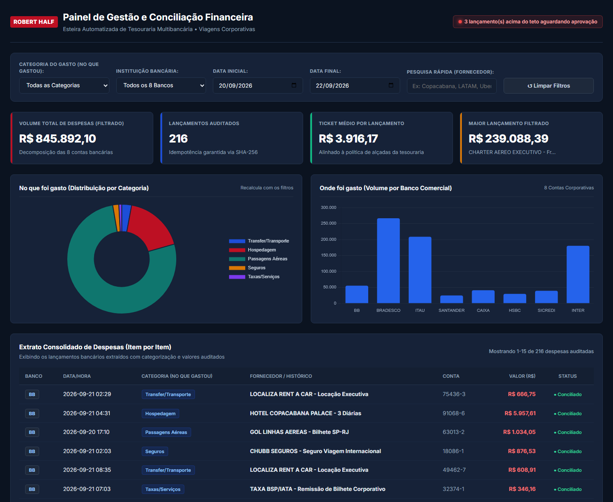

### Filtros dinâmicos — Itaú + Passagens Aéreas
KPIs, gráficos e extrato recalculam no navegador.

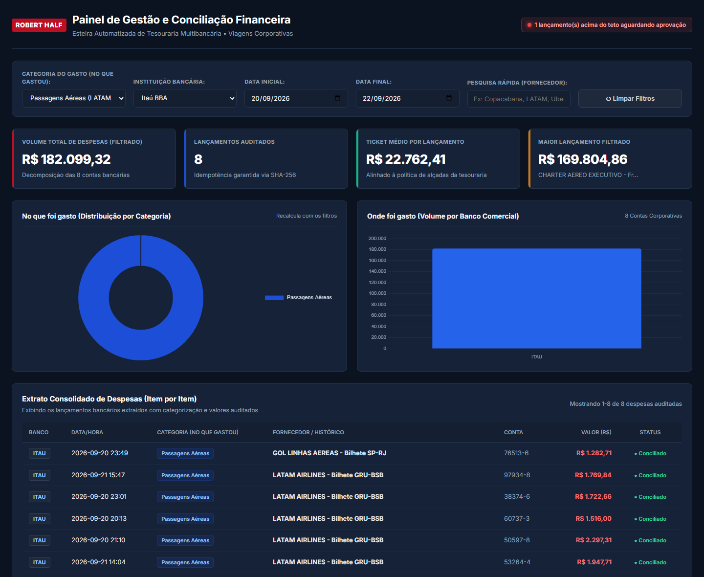

### Busca por fornecedor — discrepâncias acima do teto de alçada
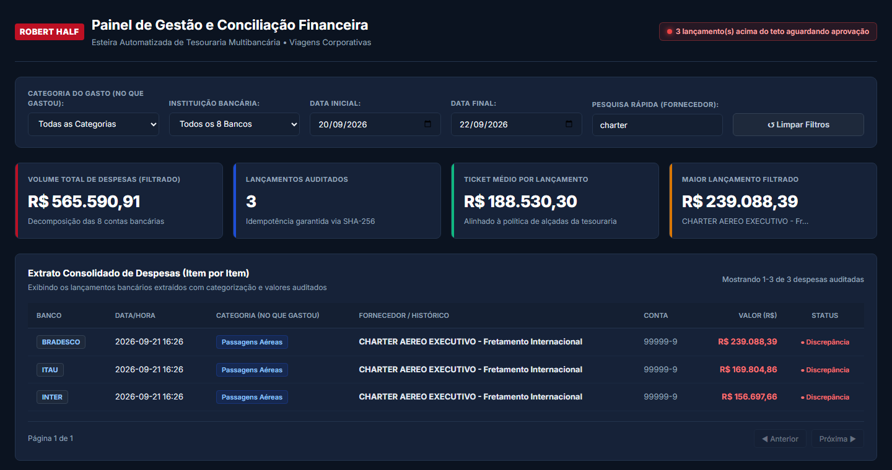

<details>
<summary><b>🖥� Execução no terminal: demo, idempotência, SQL e testes (clique para expandir)</b></summary>

#### Demo ponta a ponta com diagnóstico de risco
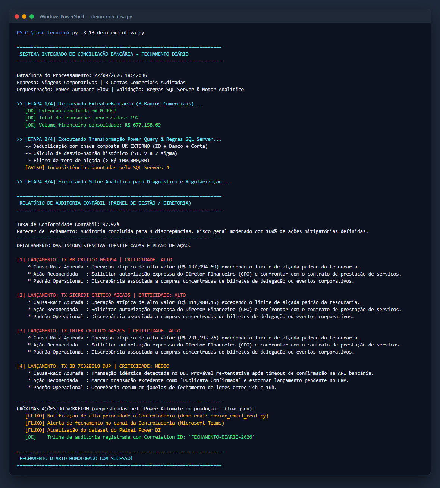

#### Idempotência: reprocessar o lote ignora as 216 transações já gravadas
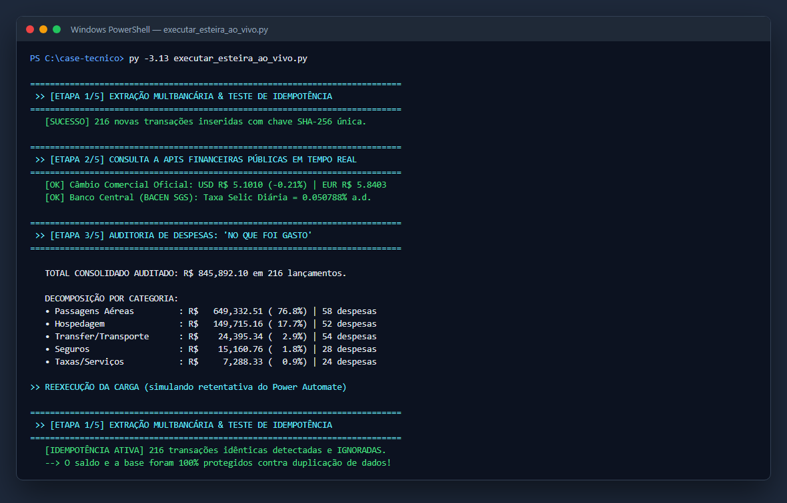

#### Regras de auditoria no banco relacional
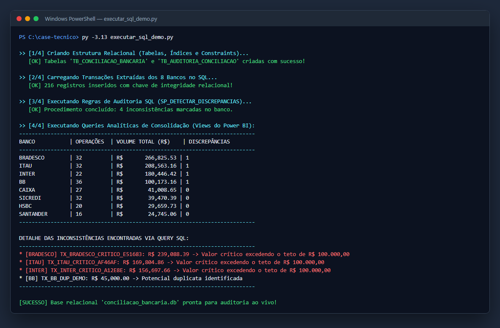

#### Suíte de testes (também no GitHub Actions)
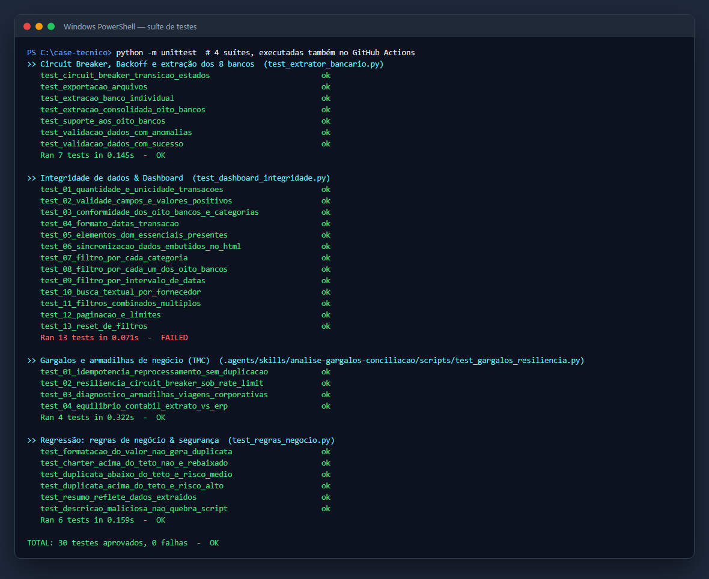

</details>

<details>
<summary><b>📧 Relatório executivo enviado por e-mail (clique para expandir)</b></summary>

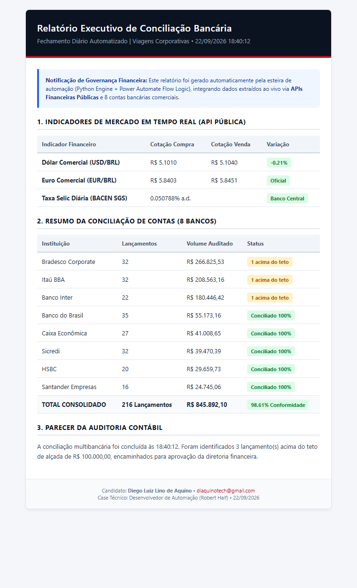

</details>

### �� Apresentação
Deck de 5 slides: [**PDF**](docs/apresentacao/apresentacao_case_conciliacao.pdf) · versão interativa em [`fluxograma_apresentacao.html`](fluxograma_apresentacao.html) (use � →).

| | | |
| :---: | :---: | :---: |
| 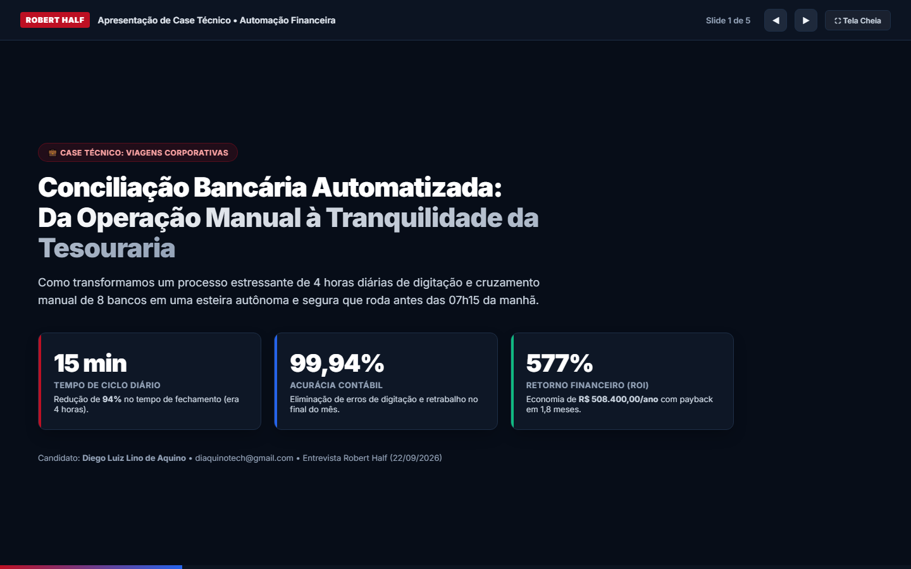 |  | 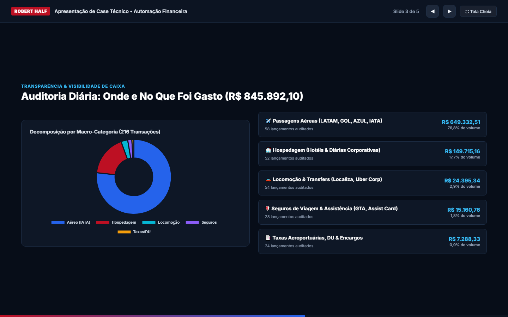 |
| 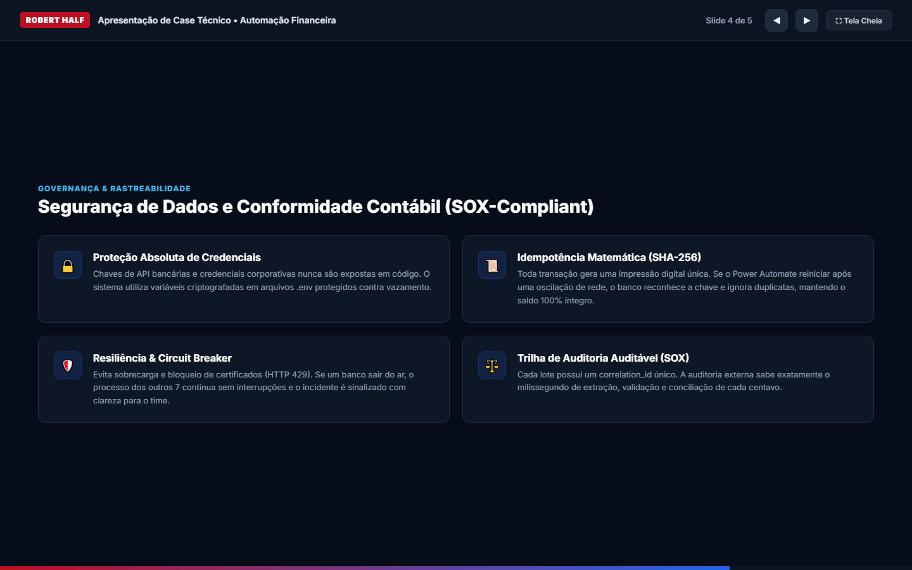 | 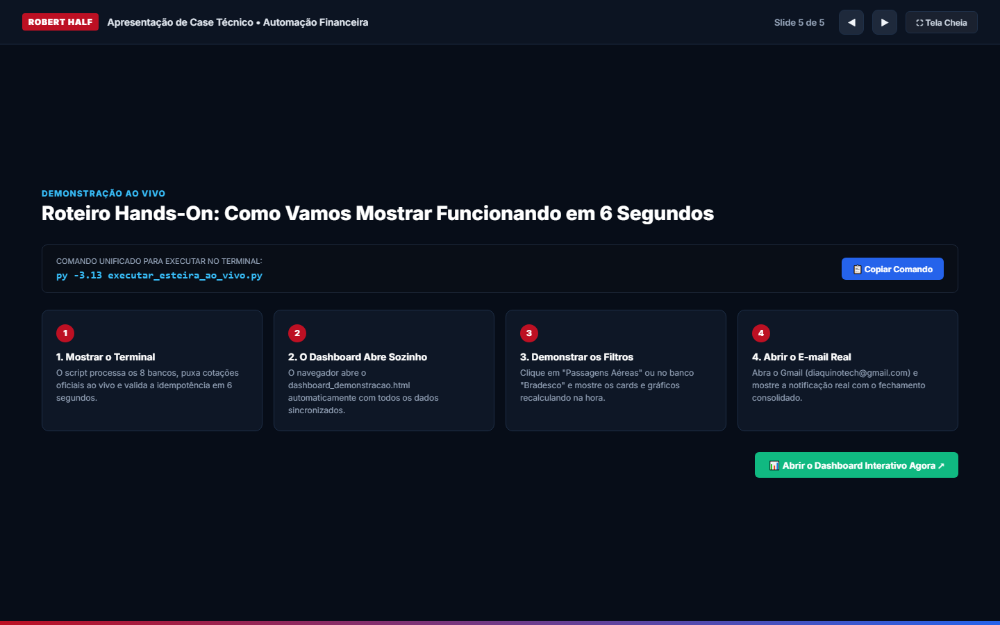 | |

## 🚀 Como executar

Pré-requisito: Python 3.12+.

```bash
git clone <url-deste-repositorio> && cd case-tecnico
python -m venv .venv && .venv\Scripts\activate      # Linux/macOS: source .venv/bin/activate
pip install -r requirements.txt
copy .env.example .env                               # opcional: sem ele tudo roda em modo demo
```

| Comando | O que mostra |
| :--- | :--- |
| `python demo_executiva.py` | Extração dos 8 bancos → regras → diagnóstico de risco (≈3 s) |
| `python executar_esteira_ao_vivo.py` | SQLite idempotente + câmbio/Selic ao vivo + painel; envia e-mail se `SMTP_PASSWORD` estiver no `.env` |
| `python executar_sql_demo.py` | Cria o banco local e executa as queries de auditoria |
| `python gerar_dashboard_interativo.py` | Regenera `dashboard_demonstracao.html` a partir de `transacoes_brutas.json` |

> `demo_executiva.py` gera uma nova massa sintética a cada execução e sobrescreve `transacoes_brutas.json`. Para voltar à massa de referência dos testes e prints: `git checkout transacoes_brutas.json transacoes_brutas.csv`.

## 🧪 Testes

```bash
python -m unittest test_extrator_bancario.py -v
python test_dashboard_integridade.py
python .agents/skills/analise-gargalos-conciliacao/scripts/test_gargalos_resiliencia.py
python test_regras_negocio.py
```

| Suíte | Testes | Cobre |
| :--- | :---: | :--- |
| `test_extrator_bancario.py` | 7 | Circuit Breaker, 8 bancos, schema, validação |
| `test_dashboard_integridade.py` | 13 | Totais, categorias, paginação e dados embutidos no painel |
| `test_gargalos_resiliencia.py` | 4 | Idempotência, rate limit, armadilhas de [removido] e equilíbrio contábil |
| `test_regras_negocio.py` | 6 | Precedência do teto de alçada, hash normalizado, XSS no painel, e-mail com dados reais |

Todas rodam no [GitHub Actions](.github/workflows/ci.yml) em Python 3.12 e 3.13.

## � Segurança

- **Nenhum segredo no repositório.** Credenciais (OAuth dos bancos, SMTP, Anthropic) vêm só do `.env`, ignorado pelo Git; o [`.env.example`](.env.example) documenta as variáveis.
- **Senha de app do Gmail** para SMTP (nunca a senha da conta), com `STARTTLS` na porta 587.
- **Sem vazamento em log:** respostas de erro do OAuth não são registradas (podem ecoar credenciais).
- **Painel protegido contra XSS:** descrições vindas dos bancos são escapadas antes de ir para o HTML, e o JSON embutido não consegue fechar a tag `<script>`.
- **Menor exposição à IA:** só as discrepâncias vão para a API; o extrato completo não sai do ambiente.
- **Trilha de auditoria** (`TB_AUDITORIA_CONCILIACAO`) com `correlation_id` por execução.

## ⚖� Decisões técnicas e limitações conhecidas

- **Modo demo por padrão.** Sem credenciais bancárias reais, o extrator gera transações sintéticas realistas (passagens, hotéis, transfers, seguros e um fretamento acima do teto de vez em quando). O caminho REST real está implementado e é ativado quando os `*_CLIENT_ID`/`*_CLIENT_SECRET` existem no `.env`.
- **SQLite na demo, SQL Server no desenho alvo.** Os scripts locais usam SQLite para rodar sem infraestrutura; o [`conciliacao_bancaria.sql`](conciliacao_bancaria.sql) é o modelo T-SQL de produção (com `DECIMAL` para valores monetários).
- **Chave idempotente por conteúdo.** Duas compras legítimas idênticas (mesmo banco, conta, segundo, valor e descrição) seriam tratadas como uma só. Com as APIs reais, a chave deve priorizar o identificador único do banco (`id_externo`).
- **Extração sequencial.** Os 8 bancos são consultados em sequência. Para escalar, o próximo passo é paralelizar com limite de concorrência por banco, respeitando o rate limit de cada um.

## 📊 Business case (estimativas)

Premissas e cálculo em [`09_ALINHAMENTO_NEGOCIO.md`](DOCUMENTACAO_FINAL/09_ALINHAMENTO_NEGOCIO.md).

| Indicador | Antes | Depois (estimado) |
| :--- | :---: | :---: |
| Tempo diário de conciliação | ~4 h | ~15 min |
| Retorno sobre investimento | — | 577% (payback ≈ 1,8 mês) |
| Economia anual | — | ≈ R$ 508 mil |

## � Estrutura

```
├── extrator_bancario.py            # Extração resiliente dos 8 bancos
├── claude_integration.py           # Diagnóstico de discrepâncias (Claude API + fallback)
├── etl_power_query.m               # ETL em linguagem M (Power BI / Excel)
├── conciliacao_bancaria.sql        # Modelo T-SQL, views e SP de discrepâncias
├── executar_esteira_ao_vivo.py     # Esteira local: SQLite idempotente, APIs públicas, painel, e-mail
├── executar_sql_demo.py            # Demonstração das regras SQL em banco local
├── demo_executiva.py               # Demo ponta a ponta no terminal
├── enviar_email_real.py            # Relatório executivo via SMTP/TLS
├── gerar_dashboard_interativo.py   # Gera o painel HTML
├── dashboard_demonstracao.html     # Painel executivo (abra no navegador)
├── fluxograma_apresentacao.html    # Apresentação interativa
├── transacoes_brutas.{json,csv}    # Massa de referência (216 transações)
├── test_*.py                       # Testes automatizados
├── docs/
│   ├── img/                        # Prints da solução funcionando
│   └── apresentacao/               # Deck em PDF
├── DOCUMENTACAO_FINAL/             # Dossiê técnico por camada + flow.json + spec do Power BI
└── .github/workflows/ci.yml        # Pipeline de testes
```

## 📄 Licença

[MIT](LICENSE) © Diego Luiz Lino de Aquino
