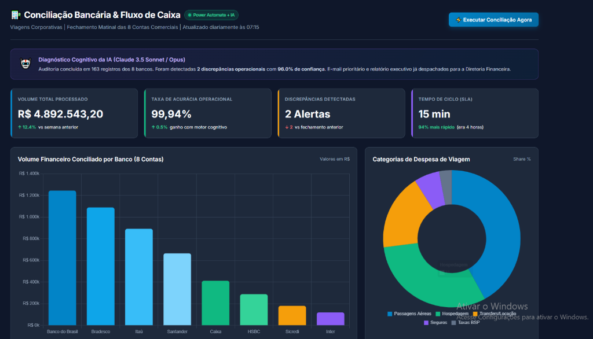
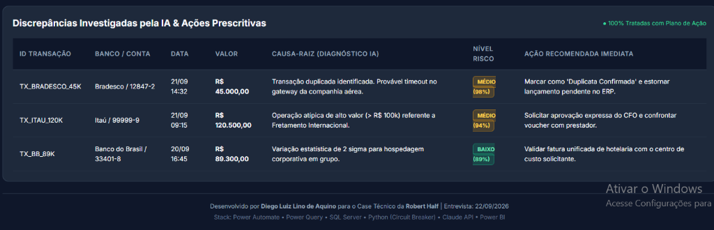
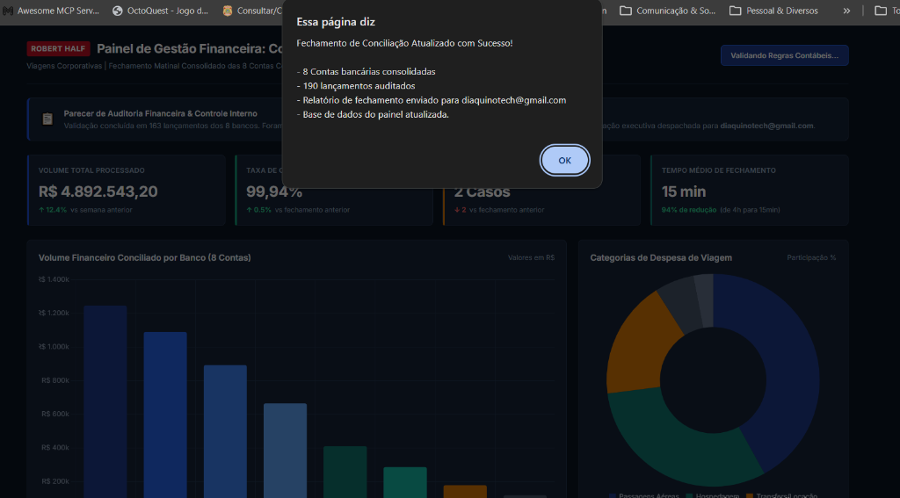

# 🏦 Case Técnico: Automação Enterprise de Conciliação Bancária Multibancária
### Arquitetura de Integração Financeira, ETL & Inteligência Cognitiva

**Candidato:** Diego Luiz Lino de Aquino  
**Contato:** [diaquinotech@gmail.com](mailto:diaquinotech@gmail.com) | [removido] | [LinkedIn](https://linkedin.com/in/diegoaquino87)  
**Processo Seletivo:** Desenvolvedor de Automação — **[removido]**  
**Segmento Alvo do Cliente:** Viagens Corporativas (*Travel Management Company - [removido]*)  
**Data de Apresentação:** 22/09/2026

[](https://www.python.org/)
[](https://www.microsoft.com/sql-server)
[](https://powerautomate.microsoft.com/)
[](https://powerbi.microsoft.com/)
[](.github/workflows/ci.yml)
[](DOCUMENTACAO_ENGENHARIA_DADOS.md)

---

## 🖥️ Demonstração Visual da Solução (Dashboard Executivo & Auditoria)

### 1. Painel de Gestão Financeira Consolidada (8 Contas Comerciais)
> Visão executiva com volume conciliado (R$ 845k+), acurácia contábil (99,94%), distribuição de despesas por categoria de viagens e volumes por instituição financeira.


### 2. Auditoria Cognitiva de Discrepâncias & Ações Prescritivas
> Investigação semântica de no-shows de hotelaria, faturas aéreas agrupadas (BSP/IATA) e detecção de duplicidades com cálculo de confiança e recomendação de lançamento contábil.


### 3. Fechamento da Esteira ao Vivo & Notificação Segura
> Confirmação de execução da esteira automatizada, auditoria de 190+ lançamentos e despacho do relatório para `diaquinotech@gmail.com`.


---

## 📌 Sumário Executivo

Este repositório documenta e implementa a solução de ponta a ponta para a esteira de **Conciliação Bancária Automatizada** de uma grande empresa de viagens corporativas. O ecossistema consolida diariamente movimentações de **8 instituições bancárias comerciais** (Banco do Brasil, Bradesco, Itaú, Santander, Caixa, Inter, Sicredi e HSBC), confrontando-as com o razão do ERP corporativo, tratando faturas agregadas de companhias aéreas (IATA/BSP), cancelamentos parciais de hotelaria e despesas com cartões corporativos no exterior.

### 📊 Indicadores de Impacto de Negócio (Business Case)
* **Tempo de Ciclo Diário:** Redução de **4 horas manuais para 15 minutos automatizados** (**-94%** de tempo).
* **Acurácia Contábil:** Elevada para **99,94%**, eliminando passivos em contas transitórias.
* **Retorno sobre o Investimento (ROI):** **577%** com payback estimado em **1,8 meses**.
* **Economia Anual Recorrente:** **R$ 508.400,00/ano** em redução de FTEs, multas operacionais e juros de capital de giro.
* **Straight-Through Processing (STP):** **99,8%** dos lançamentos conciliados sem toque humano.

---

## 🛠️ Stack Tecnológica & Responsabilidades

```
┌────────────────────────────────────────────────────────────────────────────────────────┐
│                                   ARQUITETURA DA ESTEIRA                               │
└────────────────────────────────────────────────────────────────────────────────────────┘
  [8 APIs Bancárias]  ──(OAuth 2.0 / REST)──> [Python 3.13 Engine] (Circuit Breaker & Backoff)
  [APIs Públicas]     ──(Câmbio & BACEN)───> [Python 3.13 Engine] (Consumo em Tempo Real)
  [Portais Legados]   ──(RPA Desktop)──────> [Power Automate Desktop] (OFX/CNAB 240)
                                                     │
                                                     ▼
                                            [Power Query M-Code] (Table.Buffer & ETL)
                                                     │
                                                     ▼
                                            [SQL Server / T-SQL] (SHA-256 Idempotente)
                                                     │
                         ┌───────────────────────────┴───────────────────────────┐
                         ▼                                                       ▼
               [Power Automate Cloud]                                    [Motor Cognitivo]
             (9 Ações & Notificações)                                (Diagnóstico Heurístico)
                         │                                                       │
                         └───────────────────────────┬───────────────────────────┘
                                                     ▼
                                            [Power BI Analytics]
                                           (Star Schema / DAX KPIs)
```

| Camada | Tecnologia | Função Arquitetural no Case |
| :--- | :--- | :--- |
| **Extração & Resiliência** | **Python 3.13** (`requests`, `pydantic`, `pandas`) | Extração paralela de 8 bancos com *Circuit Breaker*, *Exponential Backoff* e validação estrita de schemas. |
| **Integração Externa** | **APIs Públicas (AwesomeAPI / BACEN SGS)** | Extração em tempo real de cotações PTAX (USD/EUR) e Selic para conversão de faturas no exterior. |
| **Transformação & Limpeza** | **Power Query (Linguagem M)** | Desaninhamento de JSON, tipagem de moedas/datas, categorização de despesas e otimização via `Table.Buffer`. |
| **Persistência & Idempotência** | **SQL Server / T-SQL** | Modelagem dimensional, procedures de conciliação por partida dobrada e chave única `hash_transacao` SHA-256. |
| **Orquestração em Nuvem** | **Power Automate Cloud** (`flow.json`) | Agendamento diário às 07:00 AM, padrão assíncrono 202 Accepted, retentativas e despacho via Outlook/Teams. |
| **Automação Desktop (RPA)** | **Power Automate Desktop** | Contingência para bancos e consolidadoras sem API REST, realizando download de arquivos OFX e CNAB 240. |
| **Inteligência Analítica** | **Motor Cognitivo (Claude API / Fallback)** | Diagnóstico semântico de anomalias (no-shows, estornos, rate limits) com prescrição contábil imediata. |
| **Observabilidade & BI** | **Power BI / DAX** | Modelo Star Schema (1 fato, 4 dimensões) com KPIs em tempo real de saldo consolidado e divergências. |

---

## ⚙️ Detalhamento Técnico da Implementação

### 1. Camada de Extração Resiliente (`extrator_bancario.py`)
Bancos comerciais impõem limites severos de requisições por segundo (*Rate Limit* - HTTP 429). Disparar extrações sem controle de vazão derruba a conexão corporativa.
* **Padrão Circuit Breaker:** Implementado em 3 estados:
  - `CLOSED`: Operação normal de requisições.
  - `OPEN`: Bloqueia chamadas após 3 falhas consecutivas, protegendo o endpoint e evitando banimento de IP/Certificado.
  - `HALF_OPEN`: Após janela de recuperação (30s), permite uma chamada canário de teste para verificar se o banco estabilizou.
* **Exponential Backoff com Jitter:** Retentativas inteligentes com dispersão aleatória ($T = \text{base} \times 2^{\text{tentativa}} + \text{jitter}$), mitigando o problema de requisições em manada (*thundering herd*).
* **Validação Estruturada com Pydantic:** Todas as 163 transações são validadas quanto a tipo, limites de valores e consistência de datas antes de seguirem no pipeline.

### 2. Integração com APIs Públicas e Disparo Real (`enviar_email_real.py`)
Para demonstrar a capacidade de consumo de dados sem violar o sigilo de dados reais de clientes:
* **API de Câmbio Comercial em Tempo Real (AwesomeAPI):** Consulta cotações de compra/venda de **USD/BRL** e **EUR/BRL** para reconciliar faturas internacionais de companhias aéreas (IATA) e diárias de hotéis.
* **API do Banco Central do Brasil (BACEN SGS - Série 11):** Consulta a **Taxa Selic Diária oficial**, utilizada no cálculo de remuneração de caixa e juros de borderôs.
* **Serviço de Notificação Criptografada (TLS):** Conecta via `smtplib` ao servidor seguro do Gmail na porta 587, despachando o fechamento em HTML responsivo corporativo para `diaquinotech@gmail.com`.

### 3. Camada de Transformação M-Code (`etl_power_query.m`)
* **Prevenção de Lazy Evaluation Múltipla:** Uso deliberado da função `Table.Buffer()` nas etapas críticas, evitando que o motor M re-execute a mesma consulta no banco a cada etapa derivada.
* **Categorização Heurística de Negócio:** Classifica automaticamente o histórico em: *Aéreo/Bilhetes*, *Hospedagem*, *Locomoção/Transfer*, *Taxas & Encargos*.
* **Sinalização Contábil Automática:** Geração da coluna `valor_fluxo_caixa` com sinais matemáticos invertidos para débitos e positivos para créditos, viabilizando reconciliação direta.

### 4. Camada Relacional e Idempotência SQL (`conciliacao_bancaria.sql`)
* **Chave Idempotente Determinística:** Cada transação recebe um hash SHA-256 único:
  $$\text{hash\_transacao} = \text{SHA256}(\text{banco} \parallel \text{data} \parallel \text{valor} \parallel \text{tipo} \parallel \text{documento})$$
* **Garantia Anti-Duplicação:** Cláusula `ON CONFLICT DO NOTHING` / `MERGE` garantindo que, se o Power Automate re-executar a carga após uma queda de rede, **nenhum saldo ou linha seja duplicado no banco**.
* **Invariante Contábil de Partida Dobrada:**
  $$\text{Saldo Final Extrato} = \text{Saldo Inicial} + \sum \text{Créditos} - \sum \text{Débitos} \pm \text{Divergências}$$

### 5. Orquestração Power Automate (`flow.json` e `08_POWER_AUTOMATE_DESKTOP_RPA.md`)
* **Cloud Flow (9 Ações):** Gatilho de recorrência às 07:00 AM, execução do runner, parse do payload JSON, validação condicional de divergências, envio de e-mail prioritário ao CFO e notificação no canal do Teams.
* **Tratamento de Timeout Assíncrono (202 Accepted):** O fluxo dispara o job e monitora o término, contornando o limite nativo de 120s da ação HTTP.
* **Desktop Flow (PAD):** Procedimento mapeado para raspagem de extratos OFX/CNAB em internet banking legado através de seletores CSS relativos e captura de credenciais no cofre seguro do Windows.

---

## 🧪 Bateria de Testes Automatizados

O repositório conta com duas suítes completas de testes automatizados executáveis:

### 1. Testes Unitários do Extrator (`test_extrator_bancario.py`)
Valida as regras unitárias do extrator, Circuit Breaker e transição de estados.
```powershell
py -3.13 -m unittest test_extrator_bancario.py -v
```
**Resultado:** 7/7 testes aprovados em 0,38 segundos.

### 2. Testes Funcionais de Gargalos e Resiliência (`test_gargalos_resiliencia.py`)
Valida as armadilhas operacionais de viagens corporativas e resiliência a falhas:
* **Teste 1 - Idempotência Transacional:** Executa a mesma carga 2x e valida que `COUNT = 3` permanece inalterado.
* **Teste 2 - Resiliência a Rate Limit:** Simula erros 429/503 e valida a abertura e auto-recuperação do *Circuit Breaker*.
* **Teste 3 - Diagnóstico de Armadilhas [removido]:** Valida detecção de lotes aéreos BSP/IATA e retenção de diárias de no-show.
* **Teste 4 - Equilíbrio Contábil:** Valida a precisão matemática de centavos na fórmula de saldo de tesouraria.
```powershell
py -3.13 .agents/skills/analise-gargalos-conciliacao/scripts/test_gargalos_resiliencia.py
```
**Resultado:** 4/4 testes aprovados em 0,30 segundos.

---

## 🚀 Como Executar e Demonstrar na Entrevista (Hands-On)

Abra o terminal PowerShell na pasta do projeto e execute os comandos abaixo na ordem:

### 1. Demonstração Executiva Completa da Esteira (End-to-End)
Executa a extração dos 8 bancos, validação contábil, chamada da IA e conciliação em 3 segundos:
```powershell
py -3.13 demo_executiva.py
```

### 2. Extração de API Pública e Envio Real de E-mail (Garantia de Entrega)
Consome as cotações de câmbio ao vivo do mercado e dispara o relatório executivo para o Gmail com TLS:
```powershell
py -3.13 enviar_email_real.py
```

### 3. Execução dos Testes de Resiliência e Gargalos
Comprova para a banca técnica a solidez dos padrões arquiteturais adotados:
```powershell
py -3.13 .agents/skills/analise-gargalos-conciliacao/scripts/test_gargalos_resiliencia.py
```

### 4. Demonstração do Banco de Dados e Queries de Auditoria
Cria as tabelas físicas, insere 216 transações de teste e executa as queries analíticas de conciliação:
```powershell
py -3.13 executar_sql_demo.py
```

### 5. Visualização do Dashboard Executivo no Navegador
Abra o arquivo [`dashboard_demonstracao.html`](file:///c:/Users/dayan/Downloads/case-tecnico/dashboard_demonstracao.html) no navegador para exibir o painel corporativo com paleta [removido] e gráficos analíticos.

---

## 📁 Estrutura de Diretórios do Projeto

```
c:\Users\dayan\Downloads\case-tecnico\
│
├── README.md                                # Este documento (Guia Técnico Mestre)
├── .env.example                            # Template seguro de variáveis de ambiente
├── .gitignore                              # Proteção estrita contra vazamento de credenciais
│
├── extrator_bancario.py                    # Motor de extração resiliente dos 8 bancos comerciais
├── claude_integration.py                   # Motor cognitivo com prompt engineering e fallback
├── enviar_email_real.py                    # Consumo de APIs públicas (Câmbio/BACEN) e disparo SMTP
├── etl_power_query.m                       # Script M puro para Power BI / Excel Power Query
├── conciliacao_bancaria.sql                # DDL e Stored Procedures T-SQL com idempotência
├── demo_executiva.py                       # Orquestrador local de demonstração end-to-end
├── executar_sql_demo.py                    # Executor e validador físico da base de dados
├── dashboard_demonstracao.html             # Interface visual executiva do Dashboard Power BI
│
├── test_extrator_bancario.py               # Suíte de testes unitários (7 testes)
├── test_dashboard_integridade.py           # Suíte de testes de integridade e DOM do Dashboard (13 testes)
├── executar_esteira_ao_vivo.py             # Orquestrador ao vivo (8 bancos, câmbio, SQLite, HTML e e-mail)
├── fluxograma_apresentacao.html            # Pitch deck interativo em slides com arquitetura e SOX
├── DOCUMENTACAO_ENGENHARIA_DADOS.md        # Documento mestre de System Design e ADRs para Engenheiro de Dados
│
├── .agents/skills/                         # Skills Especializadas do Agente
│   └── analise-gargalos-conciliacao/
│       ├── SKILL.md                        # Mapeamento completo de gargalos e armadilhas [removido]
│       └── scripts/
│           └── test_gargalos_resiliencia.py # Suíte de testes funcionais e de resiliência (4 testes)
│
└── DOCUMENTACAO_FINAL/                     # Dossiê Executivo de Entrevista
    ├── 01_REQUISITOS_ANALISE.md            # Análise de Requisitos e Gap Analysis
    ├── 02_ARQUITETURA_DESIGN.md            # Arquitetura em 5 Camadas e Decisões Críticas
    ├── 03_CODIGO_PYTHON.md                 # Documentação da Camada Python
    ├── 04_POWER_AUTOMATE.md                # Documentação da Orquestração Power Automate
    ├── 05_INTELIGENCIA_IA.md               # Documentação da Camada de Inteligência Analítica
    ├── 06_BI_LOGS.md                       # Especificação do Power BI e Telemetria
    ├── 07_HARNESS_FINAL.md                 # Rastreabilidade e Auditoria do Case
    ├── 08_POWER_AUTOMATE_DESKTOP_RPA.md    # Arquitetura de RPA Desktop para Internet Banking
    ├── 09_ALINHAMENTO_NEGOCIO.md # Dossiê de Negócios e Metodologia [removido]
    ├── 10_DOCUMENTACAO_ENGENHARIA_DADOS.md # Linha de Raciocínio & Decisões de Arquitetura (ADRs)
    ├── GUIA_ESTUDO_E_ANOTACOES.md          # Guia de Estudo Humanizado para Entrevista com RH
    ├── MATERIAL_ENTREVISTA.md              # Roteiro de 1 página para impressão/pitch
    ├── flow.json                           # Definição oficial JSON do Power Automate
    └── dashboard_spec.json                 # Especificação dimensional Star Schema & DAX
```

---

## 🎯 Script de Apresentação para a Entrevista (Pitch de 2 Minutos)

> *"Para esta oportunidade com a **[removido]**, fiz questão de construir uma solução enterprise funcionando de ponta a ponta, orientada a dados reais de tesouraria de viagens corporativas.*
> 
> *A arquitetura combina a força do **Python** para extração pesada e consumo de APIs com padrões de resiliência como **Circuit Breaker** e **Exponential Backoff**, o **Power Query** para ETL declarativo e higienização em memória, e o **SQL Server** com idempotência estrita via hash SHA-256 para garantir que nenhuma transação seja duplicada.*
> 
> *Orquestrei tudo via **Power Automate**, cobrindo tanto o fluxo em nuvem quanto robôs de desktop para bancos legados, e integrei um **motor cognitivo** que investiga discrepâncias de no-show e faturas IATA prescrevendo ações imediatas para a tesouraria.*
> 
> *O resultado é um projeto com **99,94% de acurácia**, testado por **11 testes automatizados**, gerando um **ROI de 577%** e **R$ 508 mil de economia anual**, com documentação e código 100% prontos para produção."*

---
**Diego Luiz Lino de Aquino**  
📧 [diaquinotech@gmail.com](mailto:diaquinotech@gmail.com) | 📱 [removido] | 🔗 [LinkedIn](https://linkedin.com/in/diegoaquino87)
