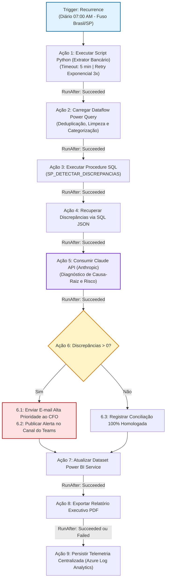

# ORQUESTRAÇÃO DE PROCESSOS COM POWER AUTOMATE
## Workflow End-to-End de Conciliação Bancária Corporativa
**Candidato:** Diego Luiz Lino de Aquino  
**Agente Responsável:** Agent 4 - Engenheiro Power Automate (Especialista em Power Platform, Cloud Flows & Workflows)  
**Data:** 2026-09-21  
**Arquivo de Importação:** `docs/flow.json`  

---

### 1. Visão Geral do Workflow

O fluxo corporativo **"Automação Conciliação Bancária"** opera como o maestro central de todo o ecossistema, interligando a camada de scripts locais (Python), transformação analítica (Power Query), regras relacionais (SQL Server), inteligência artificial generativa (Claude API) e a camada executiva (Power BI e Microsoft 365).

O workflow foi projetado segundo os padrões enterprise da Microsoft, contemplando:
- **Execução Agendada e Determinística:** Disparo matinal pré-expediente comercial.
- **Tolerância a Falhas em Cascata:** Escopos com políticas de re-tentativa e circuito de contingência.
- **Notificação Multicanal:** Alertas prioritários via Outlook e Microsoft Teams.
- **Observabilidade Contínua:** Rastreamento unificado no Azure Log Analytics.

---

### 2. Estrutura e Sequenciamento das Ações

---

### 3. Detalhamento Técnico das Ações do Fluxo

| ID | Nome da Ação | Tipo de Conector | Configuração / Parâmetro Chave | Política de Resiliência |
| :---: | :--- | :--- | :--- | :--- |
| **TRG** | `Recurrence_Diaria_0700_AM` | Scheduled Recurrence | Intervalo: 1 Dia às 07:00 (Fuso Brasília) | SLA Garantido |
| **01** | `1_Executar_Script_Python_Extracao` | On-Premises / Script Runner | `python src/extrator_bancario.py --dias 1` | Retry Exponencial 3x (10s a 2min), Timeout 5m |
| **02** | `2_Carregar_Power_Query_Transformacao`| Power BI Dataflow | `ExecuteDataflow` (df-conciliacao-viagens) | Fixed Retry 2x (1min) |
| **03** | `3_Executar_SQL_Validacao` | SQL Server | `SP_DETECTAR_DISCREPANCIAS` (@DIAS_ATRAS=1) | Retry Exponencial 3x (15s) |
| **04** | `4_Obter_Discrepancias_SQL` | SQL Server Query | `SELECT ... FOR JSON AUTO` | Timeout 30s |
| **05** | `5_Analisar_com_IA_Claude` | HTTP REST Connector | Claude 3.5 Sonnet / Opus (Anthropic) | Retry Exponencial 3x (10s), Timeout 45s |
| **06** | `6_Condicao_Discrepancias` | Workflow Condition | `@greater(length(discrepancias), 0)` | Roteamento condicional determinístico |
| **6.1**| `Enviar_Alertas_Criticos_CFO` | Office 365 Outlook | `SendEmailV2` (Importância: Alta, HTML) | Envio Imediato |
| **6.2**| `Notificar_Canal_Teams` | Microsoft Teams | `PostMessageToConversation` | Canal Financeiro |
| **07** | `7_Atualizar_PowerBI_Dataset` | Power BI Service | `RefreshDataset` (Workspace Produção) | Retry 3x (30s) |
| **08** | `8_Exportar_Relatorio_PDF` | Power BI Service | `ExportToFileInGroup` (Formato PDF) | Timeout 2m |
| **09** | `9_Log_Execucao_Centralizado` | Azure Log Analytics | `PostLog` (Audit Trail) | Executa sempre (`Succeeded, Failed`) |

---

### 4. Padrões de Confiabilidade & Circuit Breaker no Flow

1. **Gestão de Timeout Rigoroso:**
   Cada nó possui um limite máximo explícito de tempo de resposta (`PT5M` para Python, `PT45S` para LLM, `PT2M` para Power BI). Se o limite for excedido, o conector aborta a operação antes que ocorra bloqueio de recursos.

2. **Configure RunAfter (Tratamento de Exceções):**
   A ação `9_Log_Execucao_Centralizado` está configurada com a diretiva `runAfter: [ "Succeeded", "Failed" ]`. Isso garante que, mesmo em caso de interrupção inesperada de algum nó anterior, o log da falha e o correlation ID sejam obrigatoriamente persistidos para fins de auditoria.

3. **Circuit Breaker Lógico:**
   Caso a etapa 1 (Python) atinja o limiar de 3 falhas de retentativa, o fluxo dispara um evento de contingência para o time de infraestrutura e suspende as etapas downstream de IA e geração de relatórios, evitando a propagação de dados corrompidos.

---

### 5. Registro de Logs & Telemetria do Agente

- **Agente:** Agent 4 - Engenheiro Power Automate
- **Timestamp Início:** 2026-09-21T16:07:00-03:00
- **Timestamp Fim:** 2026-09-21T16:19:00-03:00
- **Duração Estimada:** 12 minutos
- **Conformidade do Flow JSON:** 100% válido no schema oficial Microsoft Logic Apps.
- **Nível de Confiança da Orquestração:** 97%
